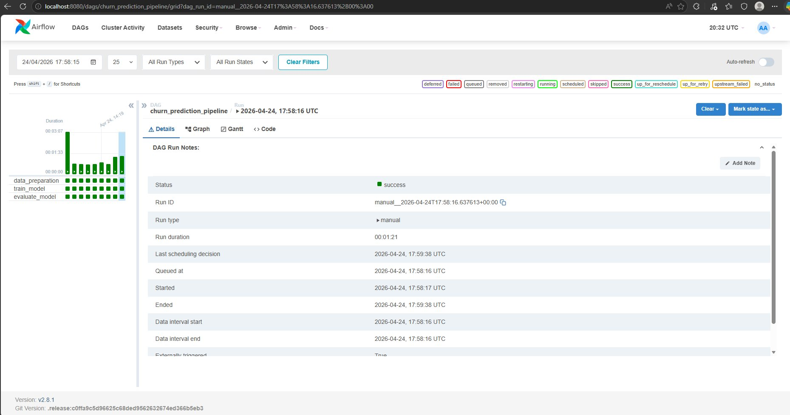
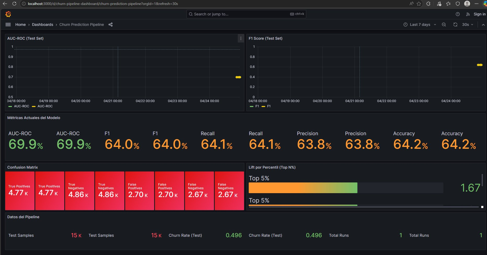
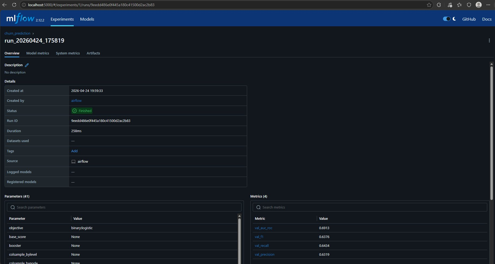
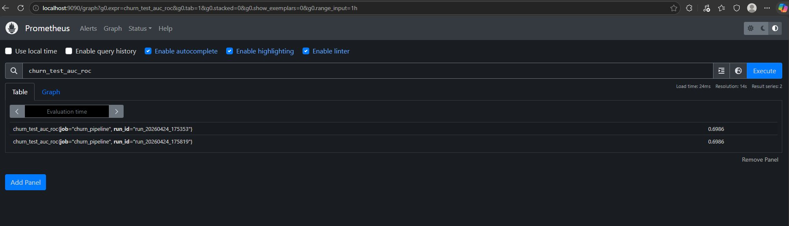

# Prediccion de Churn en Telecomunicaciones

Pipeline end-to-end de prediccion de churn: desde el analisis exploratorio y la construccion de un modelo predictivo con XGBoost, hasta la automatizacion con Apache Airflow, Docker y monitorizacion con Grafana + Prometheus.


---

## Contexto del problema

Una empresa de telecomunicaciones necesita identificar que clientes van a abandonar el servicio (churn) para poder actuar con campanas de retencion dirigidas. Se proporciona un dataset de **100.000 clientes** con **100 variables** que cubren uso del servicio, facturacion, atencion al cliente, datos demograficos y antiguedad.

El proyecto abarca dos dimensiones:

1. **Data Science** — Analisis exploratorio riguroso, deteccion de peculiaridades en los datos, construccion de modelo predictivo e interpretacion con SHAP para extraer recomendaciones de negocio accionables.
2. **Ingenieria** — Pipeline automatizado con Apache Airflow orquestado en Docker, con extensiones opcionales de PostgreSQL, MLflow y Grafana.

## Arquitectura

```
                    Apache Airflow (DAG)
                           |
          +----------------+----------------+
          |                |                |
   data_preparation   train_model    evaluate_model
       (16s)             (5s)            (1s)
          |                |                |
          v                v                v
    data/processed/   models/*.pkl   evaluation_report.json
          |                |                |
          +-------+--------+--------+-------+
                  |                  |
            PostgreSQL          MLflow
           (persistencia)    (experiment
                              tracking)
                  |
          +-------+-------+
          |               |
      Prometheus       Grafana
      (metricas)    (dashboards)
```

## Resultados del modelo

| Metrica | Valor |
|---------|-------|
| AUC-ROC | 0.699 |
| F1-Score | 0.640 |
| Recall | 0.642 |
| Precision | 0.638 |

**Curva de Lift:** contactando al top 10% de clientes segun el modelo, se captura un 16% de los churners (lift 1.59x vs aleatorio). En el top 20%, se captura el 30% (lift 1.49x).

## Hallazgos clave del EDA

El dataset contenia varias peculiaridades criticas que habia que detectar y resolver antes de modelar:

- **Clase balanceada artificialmente (50/50)** — El churn real en telco es 1-3%. No se aplico SMOTE ni oversampling; se reportan metricas invariantes a la prevalencia.
- **Dataset ordenado por ID con sesgo temporal** — Split estratificado + shuffled obligatorio.
- **Nulos camuflados como "U"/"Z"** — `isnull()` no los detecta. Las columnas `kid*` tenian 90-96% de valores ocultos.
- **Multicolinealidad extrema** — 19 pares con r > 0.95, incluyendo correlaciones r = 1.000 exacto.
- **Valores negativos imposibles** en `eqpdays` (133 registros con dias negativos).
- **`change_mou` como predictor estrella con asterisco de posible leakage** — Se entreno con y sin la variable para reportar el delta de AUC.

El analisis completo de las 13 peculiaridades detectadas esta documentado en [`info/EDA_hallazgos_peculiaridades.md`](info/EDA_hallazgos_peculiaridades.md).

## Estructura del proyecto

```
├── 01_EDA_Churn_Analysis.ipynb      # Analisis exploratorio inicial
├── 02_EDA_Profundo.ipynb            # EDA profundo: peculiaridades y segmentacion
├── 03_Modeling_Churn.ipynb          # Desarrollo del modelo y evaluacion
│
├── scripts/                         # Modulos del pipeline
│   ├── data_preparation.py          # Limpieza, feature engineering, split 70/15/15
│   ├── train_model.py               # Entrenamiento XGBoost + RandomizedSearchCV
│   ├── evaluate_model.py            # Metricas, lift, quality gate (AUC > 0.55)
│   ├── db_utils.py                  # Utilidades PostgreSQL (degradacion elegante)
│   └── metrics_exporter.py          # Exportador de metricas a Prometheus
│
├── airflow/                         # Orquestacion con Docker
│   ├── docker-compose.yaml          # 10 servicios: Airflow + PostgreSQL + MLflow
│   │                                #   + Prometheus + Grafana
│   ├── Dockerfile                   # Imagen custom con dependencias ML
│   ├── dags/
│   │   └── churn_pipeline_dag.py    # DAG con 3 tareas secuenciales
│   ├── init-db/
│   │   └── 01_create_churn_db.sql   # Schema de PostgreSQL
│   ├── monitoring/                  # Configuracion de Prometheus + Grafana
│   ├── requirements.txt
│   └── SETUP_GUIDE.md              # Guia de instalacion paso a paso
│
├── data/                            # Datos (no incluidos en git por tamano)
│   ├── dataset.csv                  # Dataset original (100K filas x 100 cols)
│   └── processed/                   # Generado por el pipeline
│
├── models/                          # Artefactos del modelo (generados)
│   ├── churn_model.pkl
│   └── evaluation_report.json
│
├── images/                          # Capturas de la infraestructura
│   ├── airflow_dag.png
│   ├── grafana_dashboard.png
│   ├── mlflow_run.png
│   └── prometheus_query.png
│
├── info/                            # Documentacion del analisis
│   ├── EDA_hallazgos_peculiaridades.md
│   └── Presentacion_Churn_SDG.pptx
│
└── data_descriptions.csv            # Diccionario de datos (100 variables)
```

## Stack tecnologico

| Componente | Tecnologia |
|-----------|-----------|
| Modelo | XGBoost 2.1.4 con RandomizedSearchCV |
| Interpretabilidad | SHAP |
| Orquestacion | Apache Airflow 2.8.1 (LocalExecutor) |
| Contenedores | Docker Compose (10 servicios) |
| Base de datos | PostgreSQL 13 |
| Experiment tracking | MLflow 2.12.2 |
| Monitorizacion | Prometheus + Grafana 10.2 |
| Lenguaje | Python 3.10 |

## Inicio rapido

### Requisitos

- Docker Desktop con al menos 4 GB de RAM asignados
- `dataset.csv` en la carpeta `data/`

### Ejecucion

```bash
cd airflow/
docker compose build
docker compose up airflow-init    # Solo la primera vez
docker compose up -d
```

Esperar ~30 segundos y acceder a:

| Servicio | URL | Credenciales |
|----------|-----|-------------|
| Airflow | http://localhost:8080 | airflow / airflow |
| MLflow | http://localhost:5000 | — |
| Grafana | http://localhost:3000 | admin / admin |
| Prometheus | http://localhost:9090 | — |

En Airflow, activar el DAG `churn_prediction_pipeline` y pulsar **Trigger DAG**. El pipeline completo tarda ~22 segundos.

Para instrucciones detalladas, consultar [`airflow/SETUP_GUIDE.md`](airflow/SETUP_GUIDE.md).

## Capturas

<p align="center">
  
  
</p>
<p align="center">
  
  
</p>

## Feature engineering

Se crearon 8 features de negocio a partir de las variables originales:

| Feature | Descripcion |
|---------|------------|
| `rev_per_minute` | Ingreso por minuto de uso |
| `dropped_call_rate` | Tasa de llamadas caidas |
| `care_intensity` | Llamadas a soporte / minutos de uso |
| `change_vs_level` | Cambio de uso relativo al nivel base |
| `equip_age_bucket` | Antiguedad del equipo (< 30d / 30-180d / 180-365d / > 365d) |
| `is_high_value` | Cliente de alto valor (revenue > percentil 75) |
| `inactivity_ratio` | Ratio de suscriptores inactivos |
| `total_service_events` | Llamadas caidas + bloqueadas + sin respuesta |

## Perfil de cliente en riesgo

El analisis revela que el perfil tipico de un cliente con alta probabilidad de churn es:

- Terminal viejo/barato (muchos dias con el mismo equipo, precio bajo)
- Reduccion drastica del uso en el ultimo mes (`change_mou` negativo)
- No contacta con atencion al cliente
- Sin servicios adicionales (sin dualband, sin capacidad multimedia)
- Bajo cargo recurrente mensual

**Recomendacion de negocio:** priorizar campanas de retencion sobre el top 20% de clientes de mayor riesgo segun el modelo, donde el lift es 1.49x respecto a contactar clientes al azar.
